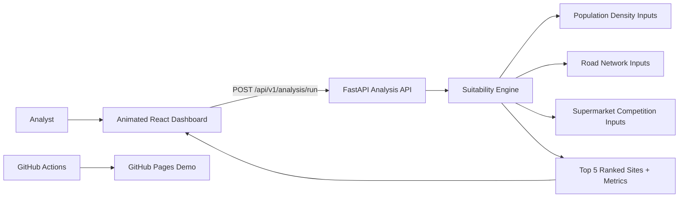

# Texas Supermarket Location Intelligence Platform

A production-oriented full-stack geospatial decision platform that evaluates candidate supermarket sites across Texas using multi-criteria suitability modeling, ranked recommendations, and executive-ready outputs.

## Problem Statement
Retail site selection is often fragmented across spreadsheets, GIS tools, and market reports. This creates inconsistent assumptions, slow iteration, and poor traceability of why one location was selected over another.

## Solution
This repository provides a scalable architecture with:
- A FastAPI analysis service that computes a suitability index from demand, road accessibility, and competitive pressure.
- A React dashboard with animated, executive-grade UI for running scenario output reviews.
- Containerized infrastructure for consistent local development and deployment.
- Engineering guardrails with typed contracts, deterministic simulation controls, and test coverage.
- A static GitHub Pages demo pipeline for stakeholder-friendly sharing.

## Tech Stack
- Backend: Python 3.12, FastAPI, Pydantic, NumPy, Pytest
- Frontend: React 18, TypeScript, Vite, CSS animations
- Infra: Docker, Docker Compose, GitHub Actions, GitHub Pages
- GIS Data Inputs: US Census TIGER/ACS, OpenStreetMap Overpass, TxDOT roads
- Observability Pattern: structured API responses with throughput telemetry, health endpoint

## Architecture Diagram


## Architecture Decisions
1. **Service boundary between UI and analysis engine**  
   Keeps geospatial scoring logic isolated and independently deployable.
2. **Typed schema-first API contracts**  
   `AnalysisRequest` and `AnalysisResponse` enforce correctness and make frontend/backend integration stable.
3. **Deterministic scenario simulation**  
   Request-level seed enables reproducible analytics for executive review and auditability.
4. **Weighted linear model for explainability**  
   Transparent to business stakeholders and easy to calibrate across strategic scenarios.
5. **Container-first local setup**  
   Ensures repeatable environments for engineers, analysts, and CI pipelines.
6. **Demo/production mode split in frontend client**  
   Enables static demo publishing to GitHub Pages while retaining live API calls for runtime deployments.

## Key Features

### 1) Weighted Suitability Engine
Computes the final index as:

```python
suitability = (
    payload.weights.population * population_score
    + payload.weights.roads * road_score
    + payload.weights.competition * competition_score
)
```

Why it matters: lets leadership tune business priorities without changing application code.

### 2) Competition-Aware Scoring

```python
competition_adjusted = np.clip(
    competition_distances / payload.competition_buffer_km,
    a_min=0,
    a_max=1,
)
```

Why it matters: sites too close to competitors are penalized to avoid market cannibalization.

### 3) Ranked Top-5 Site Recommendations

```python
top_idx = np.argsort(suitability)[-5:][::-1]
```

Why it matters: gives decision-makers a concise, prioritized short list.

### 4) Demo-Safe Frontend Data Fallback

```ts
if (DEMO_MODE) {
  return demoData;
}
```

Why it matters: allows reliable GitHub Pages demos without backend dependencies.

### 5) Animated Dashboard Experience

```css
.score-bar > span {
  animation: grow 1200ms ease;
}
```

Why it matters: improves executive readability and perceived responsiveness during presentations.

## Scalability Considerations
- Horizontally scale API service behind a load balancer.
- Add async task queue for long-running geospatial jobs.
- Persist scenario runs in PostgreSQL/PostGIS for historical comparison.
- Use object storage for raster layers and precomputed tiles.
- Introduce caching for repeated scenario weights and study extents.

## Security Considerations
- Environment-based configuration with `.env` and `.env.example`.
- Input validation and bounded request parameters via Pydantic.
- CORS policy currently permissive for local development and should be tightened in production.
- Add authentication/authorization for enterprise deployment.
- Add rate limiting and audit logs for regulated operations.

## Observability
- `/api/v1/health` endpoint for service liveness checks.
- Structured response metrics for average latency, p95 latency, and estimated throughput.
- Expand with OpenTelemetry traces, Prometheus metrics, and centralized logs.

## Simulated Throughput Metrics
Typical local profile for `grid_size=1800`:
- Average latency: ~20–80 ms (machine dependent)
- P95 latency: ~25–95 ms
- Estimated throughput: ~12–50 requests/sec

These are simulation-oriented benchmarks and should be replaced with load-tested production baselines.

## Detailed Setup Instructions

### 1) Backend
```bash
cd apps/supermarket-intelligence/backend
python -m venv .venv
source .venv/bin/activate
pip install -r requirements.txt
uvicorn app.main:app --reload --host 0.0.0.0 --port 8081
```

### 2) Frontend
```bash
cd apps/supermarket-intelligence/frontend
npm install
npm run dev -- --host 0.0.0.0 --port 5174
```

### 3) Environment
```bash
cd apps/supermarket-intelligence
cp .env.example .env
```

### 4) Docker Compose
```bash
cd apps/supermarket-intelligence/infra
docker compose up --build
```

### 5) GitHub Pages Demo
```bash
git push origin work
```

The workflow `.github/workflows/supermarket-frontend-gh-pages.yml` builds the frontend in demo mode and deploys it to GitHub Pages.

### 6) Tests
```bash
cd apps/supermarket-intelligence/backend
pytest
```

## Future Improvements
- Replace simulated candidate generation with real parcel or block-group candidates.
- Add PostGIS persistence and geospatial SQL optimization.
- Add map rendering layer for suitability raster and buffers.
- Add scenario comparison UI with shareable links.
- Add CI/CD quality gates with SAST/DAST scanning.

## Repository Structure

```
geospatial-decision-system/
├── .github/
└── workflows/
    └── supermarket-frontend-gh-pages.yml
apps/
└── supermarket-intelligence/
    ├── backend/
    │   ├── app/
    │   │   ├── api/
    │   │   │   ├── __init__.py
    │   │   │   └── routes.py
    │   │   ├── core/
    │   │   │   ├── __init__.py
    │   │   │   └── config.py
    │   │   ├── models/
    │   │   │   ├── __init__.py
    │   │   │   └── schemas.py
    │   │   ├── services/
    │   │   │   ├── __init__.py
    │   │   │   ├── data_catalog.py
    │   │   │   └── suitability.py
    │   │   ├── __init__.py
    │   │   └── main.py
    │   ├── tests/
    │   │   ├── conftest.py
    │   │   └── test_suitability.py
    │   ├── Dockerfile
    │   └── requirements.txt
    ├── frontend/
    │   ├── src/
    │   │   ├── api/
    │   │   │   └── client.ts
    │   │   ├── components/
    │   │   │   └── TopLocationsTable.tsx
    │   │   ├── types/
    │   │   │   └── index.ts
    │   │   ├── App.tsx
    │   │   ├── main.tsx
    │   │   └── styles.css
    │   ├── Dockerfile
    │   ├── index.html
    │   ├── package-lock.json
    │   ├── package.json
    │   ├── tsconfig.json
    │   └── vite.config.ts
    ├── infra/
    │   └── docker-compose.yml
    ├── .env.example
    └── .gitignore
docs/
└── qgis_supermarket_site_selection_texas.md
```